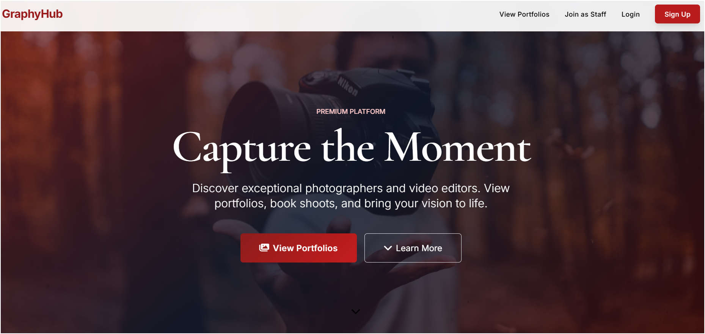
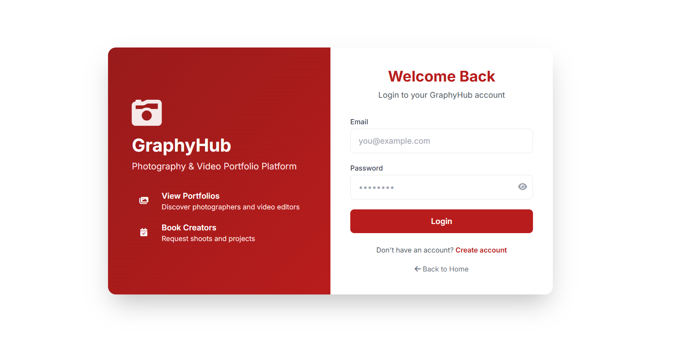
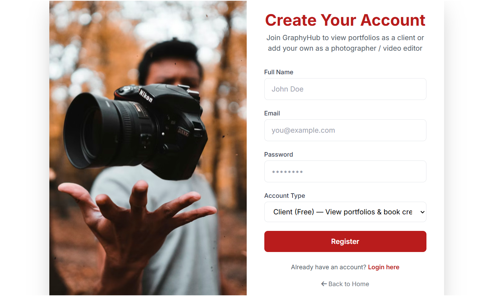
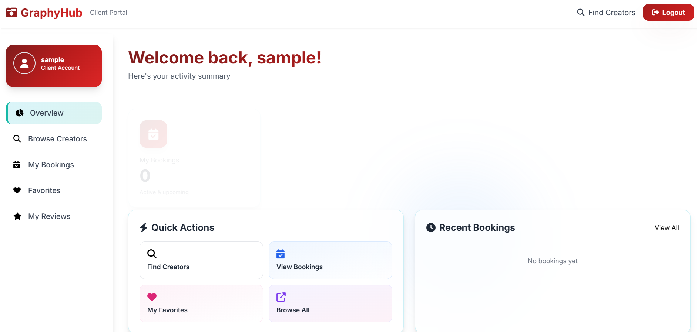

# GraphyHub — Photography & Video Portfolio Platform

A premium portfolio and booking platform for photographers and video editors. Clients can **view portfolios**, search creators, and **book** shoots. Creators can **register**, **add portfolios**, manage services and bookings.


---

## ✨ Features

### For Clients
- **View Portfolios** — Browse photographers and video editors with full portfolios
- **Search & Filters** — Search by name, city, location, rating, price
- **Book Creators** — Select services, set date, project details
- **Student Discounts** — 10% off for verified students
- **My Bookings** — Track and manage booking requests
- **Reviews** — Rate creators after projects

### For Creators (Photographers / Video Editors)
- **Creator Dashboard** — Manage profile, portfolio, services, bookings
- **Add Portfolio** — Cover image, logo, portfolio gallery
- **Services & Packages** — Define photography/video packages with pricing
- **Booking Management** — Accept, reject, manage requests
- **Registration** — One-time payment (₹10) via PayPal to list your portfolio

### For Admins
- **Admin Dashboard** — Platform stats, recent activity
- **Manage Users** — Search, filter by role, view all accounts
- **Manage Creators** — Verify, feature, manage photographers/video editors
- **Manage Bookings** — View and update booking status

---

## 🚀 Quick Start

### Prerequisites
- **Node.js** (v16+)
- **MongoDB** (local or Atlas)
- **npm** or **yarn**

### Installation

1. **Clone and install**
   ```bash
   cd GraphyHub-platform
   npm install
   ```

2. **Configure environment**  
   Create a `.env` file:
   ```env
   MONGO_URI=mongodb://localhost:27017/GraphyHub
   PORT=3000
   SESSION_SECRET=your-secret-key-change-this
   PAYPAL_CLIENT_ID=your-paypal-client-id
   PAYPAL_CLIENT_SECRET=your-paypal-client-secret
   ```

3. **Seed the database**
   ```bash
   npm run seed
   ```
   Creates 8 sample creators, 5 customers, admin, bookings, and reviews.

4. **Start the app**
   ```bash
   npm start
   ```
   Or for development with auto-reload:
   ```bash
   npm run dev
   ```

5. **Open in browser**  
   Go to [http://localhost:3000](http://localhost:3000)

---

## 🔐 Login Credentials (Sample Data)

After running `npm run seed`, use these accounts:

| Role | Email | Password | Notes |
|------|-------|----------|-------|
| **Admin** | admin@GraphyHub.com | admin123 | Full platform access |
| **Customer** | sayed@example.com | password123 | Student (10% discount) |
| **Customer** | jane@example.com | password123 | |
| **Customer** | rahul@example.com | password123 | Student |
| **Customer** | priya@example.com | password123 | |
| **Customer** | alex@example.com | password123 | |
| **Creator** | studio@frameandlight.com | password123 | Frame & Light Studio |
| **Creator** | hello@editflowvideo.com | password123 | Edit Flow Video |
| **Creator** | book@pixelcraft.in | password123 | Pixel Craft Photography |
| **Creator** | hello@cinestoryfilms.com | password123 | CineStory Films |
| **Creator** | book@momentlens.in | password123 | Moment Lens Photography |
| **Creator** | contact@clipmasters.in | password123 | Clip Masters Studio |
| **Creator** | hello@urbanlens.co | password123 | Urban Lens Co |
| **Creator** | book@reeleditpro.com | password123 | Reel Edit Pro |

**Admin URL:** [http://localhost:3000/admin](http://localhost:3000/admin)

---

## 📷 Sample Creators (8 Total)

| Creator | Location | Type | Specialties |
|---------|----------|------|-------------|
| Frame & Light Studio | Mumbai | Photography | Wedding, Portrait, Event |
| Edit Flow Video | Delhi | Video | Wedding Films, Commercial, Reels |
| Pixel Craft Photography | Bangalore | Photography | Product, Commercial, Branding |
| CineStory Films | Mumbai | Video | Wedding Films, Pre-Wedding |
| Moment Lens Photography | Pune | Photography | Candid, Wedding, Engagement |
| Clip Masters Studio | Bangalore | Video | YouTube, Ads, Social |
| Urban Lens Co | Hyderabad | Photography | Events, Travel, Editorial |
| Reel Edit Pro | Chennai | Video | Reels, Shorts, TikTok |

---

## 📁 Project Structure

```
GraphyHub-platform/
├── app.js                 # Express app entry
├── config/
│   ├── db.js              # MongoDB connection
│   └── paypal.js          # PayPal config
├── middleware/
│   └── auth.js            # Auth middleware
├── models/
│   ├── User.js
│   ├── Provider.js
│   ├── Booking.js
│   ├── Review.js
│   └── ...
├── routes/
│   ├── index.js           # Home
│   ├── auth.js            # Login/Register
│   ├── providers.js       # Browse/Search/Dashboard
│   ├── bookings.js        # Bookings
│   ├── admin.js           # Admin panel
│   └── ...
├── views/
│   ├── index.ejs
│   ├── login.ejs
│   ├── register.ejs
│   ├── providers/         # Search, show, dashboard
│   ├── bookings/
│   ├── admin/             # Dashboard, users, creators, bookings
│   └── ...
├── public/
│   ├── css/theme.css      # Premium red theme
│   └── bills/             # Generated PDF bills
├── seed/
│   └── seed.js            # Sample data seeder
└── utils/
    └── pdfGenerator.js    # PDF bills
```

---

## 🛣️ Main Routes

| Route | Description | Auth |
|-------|-------------|------|
| `GET /` | Home | Optional |
| `GET /providers` | Search creators | Optional |
| `GET /providers/:id` | View portfolio | Optional |
| `GET /providers/:id/book` | Booking form | Customer |
| `GET /providers/dashboard` | Creator dashboard | Provider |
| `GET /customer/dashboard` | Client dashboard | Customer |
| `GET /admin` | Admin dashboard | Admin |
| `GET /admin/users` | Manage users | Admin |
| `GET /admin/providers` | Manage creators | Admin |
| `GET /admin/bookings` | Manage bookings | Admin |

---

## 🛠️ Tech Stack

- **Backend:** Node.js, Express
- **Database:** MongoDB + Mongoose
- **Views:** EJS
- **Auth:** express-session, bcrypt
- **Payments:** PayPal Checkout
- **PDF:** PDFKit
- **Styling:** Tailwind CSS
- **Icons:** Font Awesome
- **Animations:** GSAP

---


## 📸 Screenshots

### 🏠 Home Page


### 🔐 Login Page


### 📝 Signup Page


### 📊 Dashboard


**Made with ❤️ for photographers and video editors**
